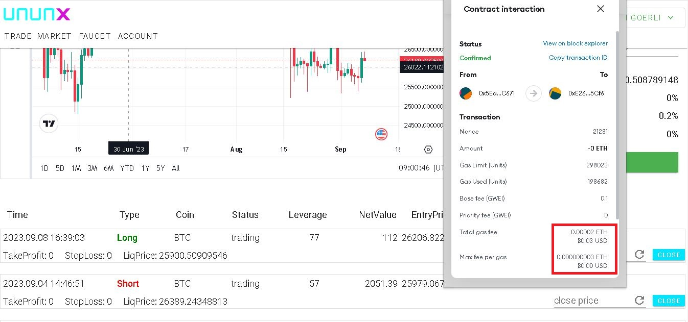
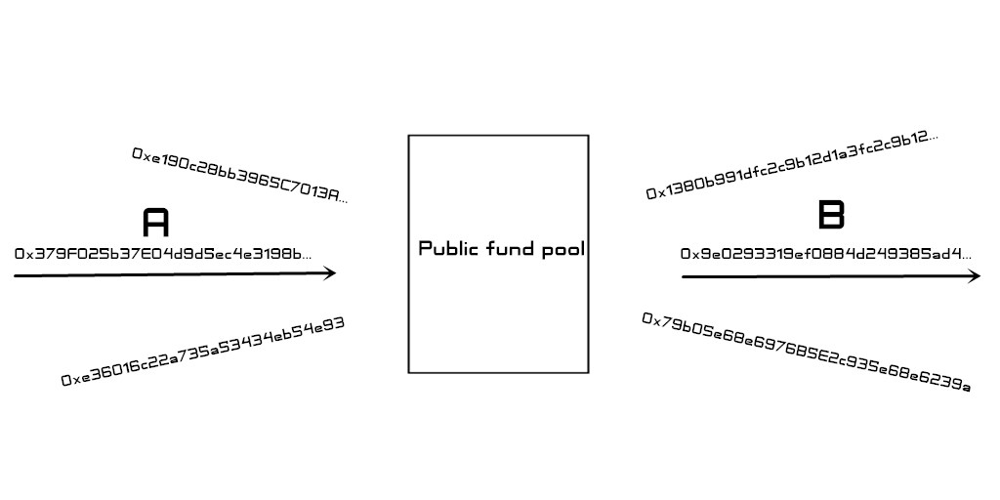
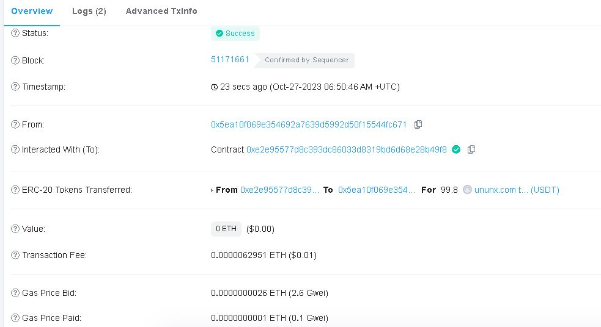

version 0.5
### UNUNX decentralized derivatives exchange
UNUNX Exchange is a decentralized full-stack exchange based on blockchain, which does not require user registration information, does not host user assets, has no geographical and national boundaries, and does not require bank accounts. It uses blockchain as the carrier and USDT as the unified base currency, aggregates global high-quality assets, and allows users to do asset allocation from a global perspective. Here you can trade cryptocurrencies or stocks, funds, futures and forex from other countries.

### Smart contracts:
The UNUNX exchange is deployed on the Ethereum two-layer chain in the form of smart contracts, all transactions are completed by on-chain smart contracts without human intervention, contracts are based on orders, and all orders are recorded in the blockchain and exist permanently. Different from DEFI's market maker mechanism, the order is completed as a whole, there is no slip point, and users do not need to consider the slip point loss and slip point arbitrage

### Assets:
At present, there are four categories of financial products, digital currency, stocks, futures and foreign exchange and other nearly 1,000 kinds of financial products on the line, and more high-quality assets will continue to be added in the future. Among them, stocks include funds and exchange indexes from major economies in the world, and the prices of different assets in different countries and transactions will be different. Stock assets are subject to the price of the regional exchange where the stock issuer is located, and do not participate in stock dividends, ex-dividend, gifts and other behaviors. Futures and foreign exchange are subject to the international general price, while digital currency, take Bitcoin as an example, has slightly different prices on each exchange, so we cannot determine which price is the most accurate. What we need to do is to establish our own price aggregation center, collect multiple trusted price suppliers including on-chain prediction machines, and take their average price as the final market price. To avoid the loss of individual exchange price anomalies to users

### Price:
In order to obtain stable and effective prices, we have built an asset price aggregation center, where multiple price suppliers provide price support for each asset, including the price of the blockchain predictor and the price of the traditional trading market. The price aggregation algorithm uses the weighted median method to remove the highest and lowest prices, and then takes the weighted average price as the final effective price. Any price offered by a price supplier that deviates too far from the market price will be automatically filtered and reduced in weight, and stable and efficient price suppliers will be rewarded with a percentage of the transaction fees.

A price aggregator would bring several benefits to users

1.Filter out intentional or unintentional price manipulation in some markets. Avoid overstock caused by excessive price fluctuations

2.Aggregate prices are appropriately weighted for prices of different levels of precision, for example: exchanges have different levels of liquidity, and less liquid exchanges tend to have larger bid-ask spreads than more liquid ones. This feature may result in one exchange reporting 1000 and another exchange reporting 1100. In these cases, the final price is closer to 1000 than 1100.

3.When a supplier unexpectedly fails to provide the price, the price provided by other suppliers in the price aggregation center will not affect the final price of the asset

### Order:
Taking uniswap as an example, most of the existing decentralized trading mechanisms require users to add liquidity, and when there is insufficient liquidity, the slip point increases, which gives arbitrageurs an opportunity to take advantage of it. UNUNX focuses on user orders, and the liquidity is undertaken by the exchange itself, so there is no problem of insufficient liquidity, insufficient transaction and slip point. Users do not have to bear the losses caused by liquidity losses, and the operating experience is similar to that of a centralized exchange. In order to further improve the safety boundary of users, we add a stop win and stop loss function to the order, which can set the stop win and stop loss price at the same time of placing the order, and automatically close the order when the price reaches the stop win and stop loss price

### Slice:
The system will package all orders to be processed into one transaction, but there is a ceiling on the Gas fee of each transaction in the blockchain. When the user has too many orders, processing too many orders in the same transaction may exceed the Gas ceiling and cause the order cannot be executed. The sharding technology can cut a large number of orders into different pieces for execution respectively. To ensure that all the shards are in the same block, the carrying capacity of different blockchains is different, and the size of the shards is adjusted by the contract tdce to adapt to different blockchains, using the sharding technology can theoretically process an unlimited number of orders within the same block。

Example: At present, there are 10,000 user orders, and 1000 orders need to be processed immediately. If 1000 orders are processed in the same transaction, it may exceed the Gas ceiling. At this time, the smart contract will cut all orders into multiple slices according to the pre-set fragment size
 

### Cost:
Transaction fee: divided into opening fee, closing fee

Opening fee: Opening fees are charged for equity assets only, no opening fee for other assets

Closing fee: Charge 0.2% on profitable orders, and there is no closing fee for all losing orders. This setting is specified by the smart contract code and is permanent and cannot be changed.

Capital rate: There is no capital rate, which means you can hold any asset for a long time

GAS fee: This fee is charged by the blockchain where the smart contract is located, and all the order information is recorded on the blockchain, so the establishment of the order needs to consume more gas fees, and we will choose the secure and cheap blockchain to deploy the smart contract. The Ethereum Layer 2 network can effectively reduce gas fees and increase transaction speed, as shown in the figure below: The gas fee required to establish an order is about $0.03
 

### Period:
The trading hours of different assets are different, digital currencies can be traded 24 hours, and other financial products need to abide by the trading hours of the regional exchanges, such as AAPL Apple stock price and trading hours are from the Dow Jones exchange in the United States

Stocks: 9.30 a.m. to 4 p.m. Eastern Daylight Time and 10.30 a.m. to 5 p.m. Winter time, the market is closed on weekends, following the New York Stock Exchange holiday and trading hours

Forex: From 5PM every Sunday to 5PM the following Friday, 24 hours a day, closed on Saturdays, trading continues during most US holidays

Futures: From 5PM every Sunday to 5PM next Friday, 24 hours a day, closed on Saturday, futures are closed following the CME holiday

### Restrictions:
Due to the limited amount of information that the blockchain can carry, a maximum of 2,000 orders can be built per account, and when the upper limit is reached, the account can be replaced to establish a new order, and all assets are denominated in USDT
Orders: Each wallet account address can accommodate up to 2000 orders

Minimum amount: 100usdt, minimum cost per order is 100usdt

Minimum leverage: 2 x,

Maximum leverage: 100 x, foreign exchange assets up to 1000 x

### Transfer of assets:
The balance after the settlement of the order is retained in the smart contract, which needs to be withdrawn by the user. The smart contract is used as a public fund pool to store the balance of all users. By default, your balance will only be withdrawn to your order account. It is then extracted by the receiving account, as shown in the following figure, Account A is transferred to account B, because the asset transfer is found inside the public contract. There will be no B account in the transaction information, and then log in to B account extraction, of course, can also be used for market transactions, there is no direct correlation between the two accounts through the public fund pool transfer, even through the gas path can not find the relationship between the two, which is more effective than the coin mixing device to protect user privacy.

Account A 0x2E29304769e5fdD... Send a message to Account B 0x5Ea10f069E354692... Transfer 100u by transfer, the balance is the market balance after you recharge or trade

Check the transaction record through the blockchain browser only the gas fee, there is no transaction amount and B account information

Account B logs in to the website through the wallet and Withdraw the Market balance. All withdrawals are made from the public balance of the market, which has nothing to do with the entry account. The balance can also be used to participate in market transactions

### Token Plan:
Symbol: UNX

Total quantity: 21,000,000, not reissued

Issue price: 0.1usdt

Launch date: 2024 Q1

We expect to emulate BTC by starting with a lower market cap and allowing it to grow naturally

20% is reserved by the project team for the development and operation of the project and for the award of outstanding contributors to the project, and 5% is released annually in 4 years

20% is used for airdrops to reward early participants

60% is voted by community users and the foundation, which is mainly used to add liquidity when the exchange is launched

### End:
UNUNX takes blockchain as the center to create a new generation of full-stack exchanges, including stocks, futures, foreign exchange, digital currency, one-stop trading of global quality assets, and every user can equally trade financial products from other countries. Decentralized contract instant trading, no custody of user assets, no user information, security, anonymity, efficiency, the future will add more emerging countries of the financial products, the global economy is rising, opportunities do not always appear in one place, with a global vision, find more opportunities.
